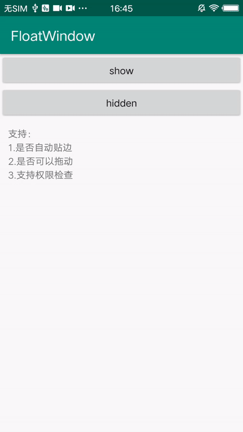

# FloatWindow 安卓任意界面悬浮窗

<!--[](https://jitpack.io/#yhaolpz/FloatWindow)-->





特性：
===

1.支持拖动，提供自动贴边等动画

2.支持权限申请操作

3.支持桌面悬浮


集成：
===

第 1 步、在工程的 build.gradle 中添加：

```
	allprojects {
		repositories {
			...
			maven { url 'https://jitpack.io' }
		}
	}
```
第 2 步、在应用的  build.gradle 中添加：

```
	dependencies {
	        compile 'com.github.yhaolpz:FloatWindow:1.0.9'
	}
```

使用：
===

**0.声明权限**

```java

     <uses-permission android:name="android.permission.SYSTEM_ALERT_WINDOW" />

```


**1.基础使用**

```kotlin
    // 自定义的View
    var view = LayoutInflater.from(context).inflate(R.layout.float_view, null)
    
    var float = FloatWindow.With(context, view)
                .setAutoAlign(true)  //是否自动贴边
                .setModality(false)
                .setMoveAble(true)   // 是否可拖动
                .setStartLocation(0, (getScreenHeight(context) * 0.7).toInt())
                .create()

```


**2.指定界面显示**

```java
              .setFilter(true, A_Activity.class, C_Activity.class)

```
此方法表示 A_Activity、C_Activity 显示悬浮窗，其他界面隐藏。

```java
              .setFilter(false, B_Activity.class)
```


